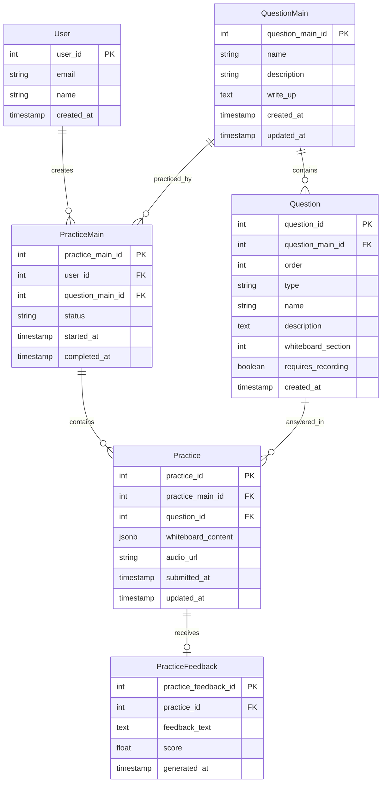

# Foundation PRD

**Document Type:** Foundation Product Requirements Document  
**Purpose:** This document contains the foundational specifications shared across all feature PRDs for the System Design Practice Application. It defines core concepts, data models, technical stack, and non-functional requirements that feature PRDs reference and build upon.

**Version:** 2.0  
**Date:** February 13, 2026  
**Status:** Draft  

---

## Referenced By

The following feature PRDs extend this Foundation PRD:

1. `01-practice-session-management.md` — Start/Resume practice, progress tracking
2. `02-two-panel-interface.md` — Screen layout, left panel components, right panel whiteboard
3. `03-whiteboard-interface.md` — Diagramming capabilities, section focus, zoom/pan, auto-save
4. `04-audio-recording.md` — Recording interface, upload flow
5. `05-practice-submission-feedback.md` — Submit practice, AI feedback generation, edit/resubmit
6. `06-navigation-completion.md` — Next question, review page, history management

---

## 1. Executive Summary

### 1.1 Product Overview
A comprehensive web application that enables users to practice system design problems through an interactive whiteboard interface. Users work through structured questions covering functional requirements, non-functional requirements, entities, APIs, and high-level system design. The application provides AI-generated feedback on user submissions, supports audio recordings for design explanations, and tracks practice progress across multiple sessions.

### 1.2 Business Objectives
- Provide a structured platform for system design interview preparation
- Enable users to practice through a guided, multi-section whiteboard approach
- Deliver AI-powered feedback to help users improve their system design skills
- Track user progress and allow session resumption
- Support both visual diagramming and audio explanations

### 1.3 Success Metrics
- User engagement: Daily active users and session completion rate
- Practice completion rate per QuestionMain
- Average feedback score improvement over time
- User retention rate (weekly/monthly)
- Audio submission rate for applicable questions
- Session resumption rate

---

## 2. User Personas

### 2.1 Primary User: Software Engineer Preparing for Interviews
- **Goals:** Practice system design problems with structured guidance and receive feedback
- **Needs:** 
  - Clear question structure and guidance
  - Ability to draw diagrams and document thinking
  - AI feedback on their solutions
  - Progress tracking across sessions
- **Pain Points:** 
  - Lack of structured practice frameworks
  - No feedback on practice attempts
  - Difficulty organizing system design thinking

---

## 3. Glossary

### Core Entities
- **QuestionMain:** A complete system design challenge (e.g., "Design Twitter"). Contains multiple ordered questions and a sample answer write-up.
- **Question:** An individual question within a QuestionMain (e.g., "Define functional requirements"). Questions are ordered and have specific types.
- **PracticeMain:** A user's practice session on a specific QuestionMain. Tracks status (practicing or completed) and contains multiple practice answers.
- **Practice:** A user's answer to a single question, consisting of whiteboard content (diagram elements) and optional audio recording.
- **PracticeFeedback:** AI-generated evaluation and feedback for a specific practice submission.

### Question Types
1. **Functional Req:** Define the functional requirements of the system
2. **Non-Functional Req:** Define scalability, performance, reliability requirements
3. **Entities:** Define data models and entities
4. **API:** Define API endpoints and contracts
5. **High Level Design:** Create system architecture diagram
6. **Deep Dive:** Detailed exploration of specific components

### Whiteboard Sections
- **Section 1:** Functional Requirements (uses diagram canvas)
- **Section 2:** Non-Functional Requirements (uses diagram canvas)
- **Section 3:** Entities (uses diagram canvas)
- **Section 4:** API (uses diagram canvas)
- **Section 5:** High Level Design (uses diagram canvas)

All sections support identical diagramming capabilities: creating blocks, text labels, arrows, and connectors.

### Session States
- **practicing:** Active session, user can continue working
- **completed:** Session finished, moved to history tables

### History Tables
- **PracticeMainHistory:** Archive of completed practice sessions
- **PracticeHistory:** Archive of individual practice answers
- **PracticeFeedbackHistory:** Archive of feedback records

---

## 4. Data Models

### 4.1 Entity Relationship Diagram



### 4.2 Detailed Schema Specifications

#### User
```typescript
{
  user_id: Integer (Primary Key, Auto-increment)
  email: string (unique, required, max 255 chars)
  name: string (required, max 100 chars)
  created_at: timestamp
  updated_at: timestamp
}
```

#### QuestionMain
```typescript
{
  question_main_id: Integer (Primary Key, Auto-increment)
  name: string (required, max 200 chars)
  description: text (optional)
  write_up: text (required) // Sample answer/solution
  created_at: timestamp
  updated_at: timestamp
}
```

#### Question
```typescript
{
  question_id: Integer (Primary Key, Auto-increment)
  question_main_id: Integer (Foreign Key → QuestionMain)
  order: integer (required) // Display order, starting from 1
  type: enum('Functional Req', 'Non-Functional Req', 'Entities', 'API', 'High Level Design', 'Deep Dive')
  name: string (required, max 200 chars)
  description: text (required)
  whiteboard_section: integer (1-5) // Which section this question uses
  requires_recording: boolean (default: false) // True for High Level Design and Deep Dive
  created_at: timestamp
}
```

#### PracticeMain
```typescript
{
  practice_main_id: Integer (Primary Key, Auto-increment)
  user_id: Integer (Foreign Key → User)
  question_main_id: Integer (Foreign Key → QuestionMain)
  status: enum('practicing', 'completed') (default: 'practicing')
  started_at: timestamp
  completed_at: timestamp (nullable)
}
```

#### Practice
```typescript
{
  practice_id: Integer (Primary Key, Auto-increment)
  practice_main_id: Integer (Foreign Key → PracticeMain)
  question_id: Integer (Foreign Key → Question)
  whiteboard_content: JSONB // Diagram data for all 5 sections
  audio_url: string (nullable, max 500 chars) // S3 URL for audio recording
  submitted_at: timestamp
  updated_at: timestamp
}
```

**Whiteboard Content Structure:**
```json
{
  "section_1": {
    "type": "diagram",
    "version": "1.0",
    "elements": [
      {
        "id": "elem1",
        "type": "rectangle",
        "x": 100,
        "y": 50,
        "width": 200,
        "height": 100,
        "text": "User Service",
        "fillColor": "#ffe7cc",
        "strokeColor": "#000000"
      },
      {
        "id": "elem2",
        "type": "text",
        "x": 150,
        "y": 200,
        "text": "Handles authentication"
      },
      {
        "id": "elem3",
        "type": "arrow",
        "startElementId": "elem1",
        "endElementId": "elem4",
        "label": "queries",
        "points": [[300, 100], [400, 100]]
      }
    ]
  },
  "section_2": { /* similar structure */ },
  "section_3": { /* similar structure */ },
  "section_4": { /* similar structure */ },
  "section_5": { /* similar structure */ }
}
```

#### PracticeFeedback
```typescript
{
  practice_feedback_id: Integer (Primary Key, Auto-increment)
  practice_id: Integer (Foreign Key → Practice)
  feedback_text: text (required) // AI-generated feedback
  score: float (nullable, 0-100) // Optional numerical score
  generated_at: timestamp
}
```

#### History Tables
```sql
-- Same schemas as active tables
CREATE TABLE practice_main_history AS SELECT * FROM practice_main WHERE 1=0;
CREATE TABLE practice_history AS SELECT * FROM practice WHERE 1=0;
CREATE TABLE practice_feedback_history AS SELECT * FROM practice_feedback WHERE 1=0;
```

---

## 5. API Base Configuration

### 5.1 Base URL
```
Production: https://api.hellointerview.com/v1
Development: http://localhost:8000/v1
```

### 5.2 Authentication
All endpoints require authentication via Bearer token:
```
Authorization: Bearer {jwt_token}
```

---

## 6. Non-Functional Requirements

### 6.1 Performance
- Page load time: < 2 seconds
- Whiteboard rendering: < 500ms
- Auto-save response: < 200ms
- AI feedback generation: < 30 seconds (text-only), < 60 seconds (with audio)
- API response time: < 500ms (excluding AI feedback)
- Support for 1000 concurrent users

### 6.2 Storage and Data
**Database:**
- PostgreSQL 14+ with JSONB support
- Indexing on frequently queried fields (user_id, question_main_id, status)
- JSONB GIN indexes for whiteboard_content queries

**File Storage:**
- Audio files: AWS S3 or equivalent
- Max file size: 50MB per audio
- Retention: Active sessions indefinite, history 2 years
- Encryption at rest

**Data Volume Estimates:**
- Avg whiteboard_content size: 50KB - 500KB
- Avg audio file size: 2-5MB
- Practices per user per month: 10-50

### 6.3 Security
- Authentication: JWT tokens, expiry 24 hours
- Authorization: Users can only access their own practices
- HTTPS required for all connections
- Audio upload: Signed S3 URLs, expiry 1 hour
- Input validation: All user inputs sanitized
- Rate limiting: 100 requests/minute per user
- XSS protection: Content Security Policy headers
- CORS: Whitelist allowed origins

### 6.4 Scalability
- Horizontal scaling capability for API servers
- Database read replicas for query load
- CDN for static assets
- S3 for distributed file storage
- Background job queue for AI feedback generation
- Caching: Redis for session data and frequently accessed QuestionMains

### 6.5 Reliability
- 99.9% uptime SLA
- Automated backups: Daily full, hourly incremental
- Database replication: Multi-AZ
- Graceful error handling with user-friendly messages
- Circuit breaker for external services (LLM API)
- Retry logic for transient failures

### 6.6 Usability
- Mobile-responsive design (min width: 768px for optimal whiteboard experience)
- Accessible (WCAG 2.1 Level AA compliance)
- Keyboard shortcuts for common actions
- Browser support: Chrome, Firefox, Safari, Edge (last 2 versions)
- Undo/redo with Ctrl+Z / Ctrl+Y
- Loading states for all async operations
- Error messages with actionable guidance

### 6.7 AI Integration
**LLM Service:**
- Provider: OpenAI GPT-4 or Anthropic Claude 3
- Timeout: 60 seconds
- Retry: 2 attempts with exponential backoff
- Fallback: Queue for later processing if service unavailable

**Audio Transcription:**
- Service: OpenAI Whisper API or AWS Transcribe
- Languages: English (initial), expand later
- Timeout: 90 seconds

**Cost Management:**
- Token usage tracking per request
- Budget alerts
- Rate limiting per user (10 feedback requests per hour)

---

## 7. Technical Implementation Stack

### 7.1 Frontend Stack
**Framework:** React 18+ with Next.js 14
**Language:** TypeScript
**State Management:** Zustand or React Context API
**Diagramming:** Excalidraw React components
**Styling:** Tailwind CSS
**HTTP Client:** Axios or Fetch API
**Audio Recording:** MediaRecorder API
**Build Tool:** Vite or Next.js bundler

### 7.2 Backend Stack
**Framework:** Spring Boot 3.2+
**Language:** Java 21
**Build Tool:** Maven
**Database:** PostgreSQL 14+ with JSONB
**ORM:** Spring Data JPA (Hibernate)
**Database Migration:** Flyway
**File Storage:** AWS S3
**Caching:** Redis
**Background Jobs:** Spring @Async or Spring Batch
**API Documentation:** OpenAPI/Swagger (SpringDoc)
**Additional Dependencies:** Lombok (code generation)

### 7.3 AI Integration
**LLM Service:** OpenAI GPT-4 or Anthropic Claude 3 Opus
**Transcription:** OpenAI Whisper API
**Libraries:** 
- Java: OpenAI Java SDK, HTTP clients (RestTemplate/WebClient) for API integration

### 7.4 Infrastructure
**Hosting:** AWS, GCP, or Azure
**Compute:** ECS/EKS, Cloud Run, or App Service
**Database:** RDS PostgreSQL or Cloud SQL
**Storage:** S3 or Cloud Storage
**CDN:** CloudFront or Cloud CDN
**Monitoring:** DataDog, New Relic, or CloudWatch
**Logging:** ELK Stack or Cloud Logging
**CI/CD:** GitHub Actions, GitLab CI, or CircleCI

---

## 8. Security and Privacy

### 8.1 Data Security
- All data encrypted at rest (AES-256)
- All data encrypted in transit (TLS 1.3)
- Audio files: Server-side encryption in S3
- Database: Encrypted volumes
- Secrets management: AWS Secrets Manager or similar

### 8.2 Authentication and Authorization
- JWT tokens with RS256 signing
- Token expiry: 24 hours
- Refresh token: 30 days
- Multi-factor authentication (optional)
- Password requirements: min 8 chars, complexity rules

### 8.3 Privacy
- Users can only access their own practice data
- No sharing of practice content with other users
- Audio recordings not used for training AI models
- PII protection: No personal data sent to LLM
- GDPR compliance: Right to deletion, data export

### 8.4 Rate Limiting
- API: 100 requests/minute per user
- Feedback generation: 10 requests/hour per user
- Audio upload: 5 uploads/hour per user
- Bypass for premium users (future)

### 8.5 Audit Logging
- Log all practice submissions
- Log all feedback generations
- Log authentication events
- Log data access and modifications
- Retention: 90 days

---

## 9. Deployment and Release

### 9.1 Deployment Strategy
**Environments:**
- Development: Local and shared dev environment
- Staging: Pre-production testing
- Production: Live system

**Release Process:**
1. Code review and approval
2. Automated tests pass (unit, integration, E2E)
3. Deploy to staging
4. QA verification in staging
5. Deploy to production (blue-green or canary)
6. Monitor for errors
7. Rollback plan within 5 minutes if needed

### 9.2 Database Migrations
- Version controlled (Alembic, Flyway, or Prisma)
- Backward compatible
- Tested in staging before production
- Rollback scripts prepared

### 9.3 Feature Flags
- Use feature flags for gradual rollout
- Critical features: AI feedback, audio recording
- A/B testing capability

### 9.4 Monitoring and Alerts
**Metrics to Track:**
- API response times (p50, p95, p99)
- Error rates by endpoint
- AI feedback generation time
- Database query performance
- S3 upload success rate
- User session duration
- Practice completion rate

**Alerts:**
- Error rate > 1%
- API response time p95 > 2 seconds
- AI feedback timeout rate > 5%
- Database connection pool exhausted
- Disk space > 80%

### 9.5 Rollback Procedures
1. Identify issue via monitoring
2. Assess impact and severity
3. Execute rollback:
   - Revert to previous application version
   - If DB changes: Run rollback migration
   - Clear caches if needed
4. Verify system health
5. Notify team and stakeholders
6. Post-mortem and prevention plan

---

## 10. Success Criteria

### 10.1 Launch Criteria (V1)
- All P0 features implemented and tested
- No critical or high-priority bugs
- Performance benchmarks met
- Security review completed
- At least 10 QuestionMains available
- Documentation complete (API, user guides)
- Monitoring and alerting configured

### 10.2 Post-Launch Metrics (3 months)
- 1000+ registered users
- 70% completion rate for started practice sessions
- Average feedback generation time < 30 seconds
- 99.5%+ uptime
- User satisfaction score > 4.0/5.0
- < 0.5% error rate

---

## 11. Dependencies and Assumptions

### 11.1 Dependencies
- User authentication system (existing or to be built)
- AWS/GCP/Azure account with appropriate permissions
- OpenAI or Anthropic API access and budget
- PostgreSQL database provisioning
- S3 or equivalent object storage
- Content team to create initial QuestionMains

### 11.2 Assumptions
- Users have stable internet connectivity (min 5 Mbps)
- Users have modern web browsers (last 2 versions)
- Users have microphone access for audio recording
- Users understand basic system design concepts
- English language only for V1
- Desktop/laptop usage primarily (not mobile-first)
