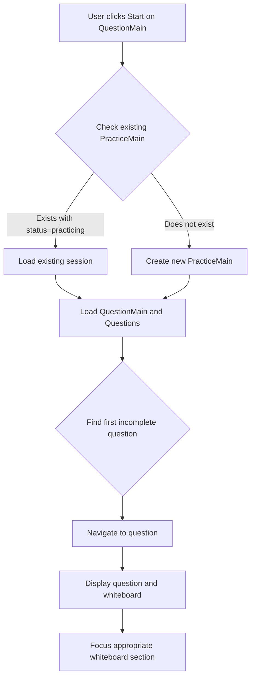
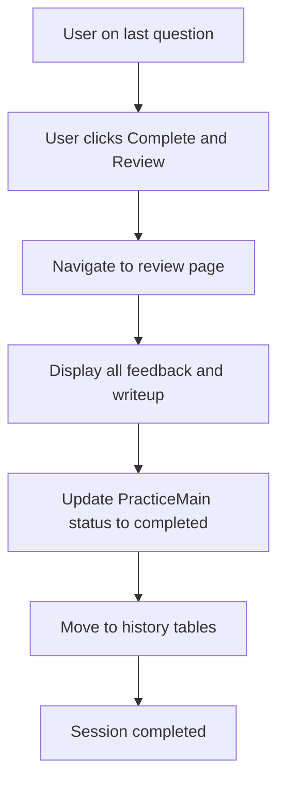

# Practice Session Management PRD

**Version:** 1.0  
**Date:** February 14, 2026  
**Status:** Draft  

See [Foundation PRD](00-foundation.md) for data models and authentication.

---

## 1. Feature Overview

Practice Session Management enables users to start, resume, and complete system design practice sessions. When a user clicks "Start" on a QuestionMain, the system checks for an existing active session and either resumes it or creates a new one. Users can track their progress across questions via progress indicators, navigate between questions, and complete sessions to reach the review page. This feature is foundational to the practice experience—it orchestrates session lifecycle, progress persistence, and navigation flows.

---

## 2. Integration Points

- **Foundation PRD:** Depends on PracticeMain, Practice, Question, and QuestionMain data models; user authentication
- **Whiteboard PRD:** Session management loads and focuses the appropriate whiteboard section per question
- **Practice Submission PRD:** Progress dots reflect which questions have practice submissions
- **Review PRD:** Completion flow navigates to the review page; full review details are specified in the Review PRD

---

## 3. Functional Requirements

### 3.1 Practice Session Management

#### 3.1.1 Start/Resume Practice Session
**Priority:** P0 (Must Have)

**User Story:**  
As a user, when I click "Start" on a QuestionMain, the system should check if I have an existing practice session and either resume it or create a new one.

**Acceptance Criteria:**
- System checks for existing PracticeMain with status='practicing' for the user and QuestionMain
- If exists: Load existing session and navigate to first incomplete question
- If not exists: Create new PracticeMain with status='practicing' and navigate to first question
- User sees progress indicators reflecting current state

**API Flow:**
```
1. GET /api/v1/practice-main?user_id={id}&question_main_id={id}&status=practicing
2. If found: Return existing PracticeMain
3. If not found: POST /api/v1/practice-main to create new session
4. GET /api/v1/question-mains/{id} to load all questions
5. Navigate to appropriate question based on progress
```

#### 3.1.2 Progress Tracking
**Priority:** P0 (Must Have)

**User Story:**  
As a user, I want to see my progress across all questions so I can track what I've completed.

**Acceptance Criteria:**
- Progress dots display at top of left panel
- Blue dot indicates question has a practice submission
- Grey dot indicates no submission yet
- Grey outline indicates currently selected question
- Clicking any dot navigates to that question
- Progress persists across sessions

### 3.2 Navigation and Completion

#### 3.2.1 Next Question Navigation
**Priority:** P0 (Must Have)

**Behavior:**
- "Next Question" button moves to next question in sequence (order + 1)
- Updates URL/route to reflect current question
- Loads next question's content and focuses appropriate whiteboard section
- Progress dots update to show current question
- On last question: Button text changes to "Complete and Review"

#### 3.2.2 Review Page
**Priority:** P0 (Must Have)

**User Story:**  
After completing all questions, I want to review all my feedback and see the sample answer.

**Acceptance Criteria:**
- Shown after clicking "Complete and Review" on last question
- Displays:
  - All questions with their feedback
  - Overall completion summary
  - Sample answer/write-up for the QuestionMain
- Actions:
  - View individual question details
  - Download/export session (optional)
  - Start new practice on different QuestionMain
- Marks PracticeMain as completed and moves to history

*Full review page specifications are in the Review PRD.*

---

## 4. User Flows

### 4.1 Start New Practice Session



### 4.2 Complete Practice Session Flow



---

## 5. API Endpoints

### 5.1 Get Active Practice Session

```
GET /api/v1/practice-main

Query Parameters:
- user_id: integer (required)
- question_main_id: integer (required)
- status: string (default: "practicing")

Response (200 OK):
{
  "practice_main_id": 123,
  "user_id": 456,
  "question_main_id": 1,
  "status": "practicing",
  "started_at": "2026-02-13T09:00:00Z",
  "completed_at": null
}

Response (404 Not Found):
{
  "error": "No active practice session found"
}
```

### 5.2 Create Practice Session

```
POST /api/v1/practice-main

Request Body:
{
  "question_main_id": 1
}

Response (201 Created):
{
  "practice_main_id": 123,
  "user_id": 456,
  "question_main_id": 1,
  "status": "practicing",
  "started_at": "2026-02-13T09:00:00Z"
}
```

### 5.3 Update Practice Session Status

```
PATCH /api/v1/practice-main/{id}

Request Body:
{
  "status": "completed"
}

Response (200 OK):
{
  "practice_main_id": 123,
  "status": "completed",
  "completed_at": "2026-02-13T11:30:00Z"
}
```

---

## 6. UI Components

### 6.1 Progress Dots

**Placement:** Top of left panel

**Behavior:**
- Display one dot per question
- Visual states:
  - Blue filled: Has practice submission
  - Grey filled: No submission
  - Grey outline: Currently selected
- Hovering shows question name tooltip
- Clicking navigates to that question

**Component Specifications:**
- Size: 12px diameter
- Spacing: 8px between dots
- Colors:
  - Complete: Blue (#3B82F6)
  - Incomplete: Gray (#D1D5DB)
  - Current: Blue border, white fill
- Hover: Scale 1.2x, show tooltip

### 6.2 Navigation

**"Next Question" Button:**
- Location: Bottom of left panel
- Behavior: Moves to next question in sequence
- On last question: Text changes to "Complete and Review"
- Updates URL/route to reflect current question

---

## 7. Testing Scenarios

**Practice Session Management:**
1. User starts new practice → Creates PracticeMain with status='practicing'
2. User returns to QuestionMain → Resumes at first incomplete question
3. User completes all questions → Status changes to 'completed', moves to history
4. Multiple users practice same QuestionMain → Isolated sessions

**Progress and Navigation:**
11. User clicks progress dot → Navigates to that question, focuses correct section
12. User clicks "Next Question" → Moves to next in sequence
13. User on last question clicks "Complete" → Shows review page
14. Progress dots update → Reflect answered vs unanswered questions

**Feedback Generation (session-related):**
22. LLM service fails → Graceful error message, retry option
23. User edits and resubmits → New feedback generated, old preserved in DB
24. Feedback includes score → Score displayed prominently

**Edge Cases:**
25. User loses internet connection → Shows offline message, queues saves
26. Browser crashes mid-practice → Can resume from last auto-save
27. Concurrent edits in different tabs → Last save wins, conflict warning
