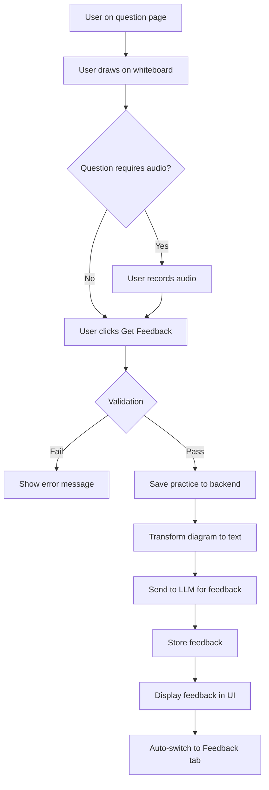

# AI Feedback System PRD

**Document Type:** Feature Product Requirements Document  
**Feature:** AI Feedback Generation for Practice Submissions  

See [Foundation PRD](00-foundation.md) for data models and infrastructure. Uses output from [Audio Recording](03-audio-recording.md).

**Version:** 2.0  
**Date:** February 13, 2026  
**Status:** Draft  

---

## 1. Feature Overview

The AI Feedback System enables users to receive AI-generated evaluation and feedback on their system design practice submissions. When a user completes their whiteboard diagram (and optional audio recording for High Level Design and Deep Dive questions) and clicks "Get Feedback", the system:

1. Validates the submission (whiteboard content, audio when required)
2. Saves the practice to the backend
3. Transforms diagram JSON to structured text for LLM consumption
4. Constructs an evaluation prompt with question context, diagram description, and optional audio transcription
5. Sends the prompt to an LLM API (OpenAI/Anthropic)
6. Parses and stores the feedback
7. Returns feedback to the frontend for display

The system supports edit-and-resubmit workflows: users can improve their answers and request new feedback, with each submission creating a new PracticeFeedback record while preserving history in the database.

---

## 2. Practice Submission and Feedback

### 2.1 Submit Practice
**Priority:** P0 (Must Have)

**User Story:**  
As a user, when I click "Get Feedback", the system should save my whiteboard content and audio, then return AI-generated feedback.

**Acceptance Criteria:**
- Validation:
  - Whiteboard content must not be empty for active section
  - Audio recording required for High Level Design/Deep Dive questions
- On click:
  - Show loading spinner
  - Submit practice data
  - Display feedback in Feedback tab
  - Auto-switch to Feedback tab
- Feedback includes:
  - Text evaluation
  - Specific suggestions
  - Optional numerical score

**API Request:**
```
POST /api/v1/practice
{
  "practice_id": 123 (if updating existing),
  "practice_main_id": 456,
  "question_id": 789,
  "whiteboard_content": { /* JSONB structure */ },
  "audio_url": "https://s3.../recording.webm"
}
```

**API Response:**
```
{
  "practice_id": 123,
  "feedback": {
    "practice_feedback_id": 999,
    "feedback_text": "Your functional requirements are well-defined...",
    "score": 85.5,
    "generated_at": "2026-02-13T10:30:00Z"
  }
}
```

### 2.2 AI Feedback Generation
**Priority:** P0 (Must Have)

**Process:**
1. Backend receives practice submission
2. Transform diagram JSON to structured text description
3. Construct LLM prompt with:
   - Question context
   - Diagram description
   - Audio transcription (if provided)
   - Evaluation criteria
4. Send to LLM API (OpenAI/Anthropic)
5. Parse and store feedback
6. Return to frontend

**Diagram to Text Transformation:**
```python
def diagram_to_text(section_data):
    elements = section_data['elements']
    description = []
    
    # Extract components
    for elem in elements:
        if elem['type'] in ['rectangle', 'circle']:
            text = elem.get('text', 'Unnamed')
            description.append(f"- Component: {text}")
    
    # Extract connections
    arrows = [e for e in elements if e['type'] == 'arrow']
    for arrow in arrows:
        label = arrow.get('label', '')
        description.append(f"- Connection: {arrow['startElementId']} -> {arrow['endElementId']} ({label})")
    
    # Extract annotations
    texts = [e for e in elements if e['type'] == 'text']
    for text in texts:
        description.append(f"- Note: {text['text']}")
    
    return "\n".join(description)
```

**LLM Prompt Template:**
```
You are evaluating a system design answer for the following question:

Question Type: {question_type}
Question: {question_description}

User's Diagram:
{diagram_text_description}

Audio Transcription (if provided):
{audio_transcription}

Please provide constructive feedback covering:
1. Completeness: Are all necessary components included?
2. Correctness: Are the components and connections appropriate?
3. Clarity: Is the design clearly communicated?
4. Best Practices: Does it follow system design best practices?
5. Improvements: What could be added or changed?

Provide a score from 0-100 and detailed textual feedback.
```

**Performance Requirements:**
- Feedback generation time: < 30 seconds for text-only
- Feedback generation time: < 60 seconds with audio transcription
- Fallback if LLM service fails: "Feedback temporarily unavailable, please try again"

### 2.3 Edit and Resubmit
**Priority:** P0 (Must Have)

**User Story:**  
After receiving feedback, I want to improve my answer and get new feedback.

**Acceptance Criteria:**
- After feedback displayed, user can still edit whiteboard
- Clicking "Get Feedback" again submits updated content
- Updates existing Practice record (same practice_id)
- Creates new PracticeFeedback record
- Feedback history preserved in database
- UI shows latest feedback only

---

## 3. Practice and Submit Flow



---

## 4. API Specification

### 4.1 Submit/Update Practice

```
POST /api/v1/practice

Request Body:
{
  "practice_id": 789 (optional - if updating existing),
  "practice_main_id": 123,
  "question_id": 1,
  "whiteboard_content": {
    "section_1": {
      "type": "diagram",
      "version": "1.0",
      "elements": [...]
    },
    ...
  },
  "audio_url": "https://s3.amazonaws.com/..."
}

Response (200 OK):
{
  "practice_id": 789,
  "practice_main_id": 123,
  "question_id": 1,
  "feedback": {
    "practice_feedback_id": 999,
    "feedback_text": "Your solution demonstrates...",
    "score": 85.5,
    "generated_at": "2026-02-13T10:05:00Z"
  },
  "submitted_at": "2026-02-13T10:05:00Z"
}

Error Responses:
- 400 Bad Request (validation failed)
- 500 Internal Server Error
```

---

## 5. AI Integration

**LLM Service:**
- Provider: OpenAI GPT-4 or Anthropic Claude 3
- Timeout: 60 seconds
- Retry: 2 attempts with exponential backoff
- Fallback: Queue for later processing if service unavailable

**Audio Transcription:**
- Service: OpenAI Whisper API or AWS Transcribe
- Languages: English (initial), expand later
- Timeout: 90 seconds

**Cost Management:**
- Token usage tracking per request
- Budget alerts
- Rate limiting per user (10 feedback requests per hour)

---

## 6. AI Service Failures

**LLM Timeout:**
- Retry once after 30 seconds
- If still fails: "Feedback generation is taking longer than expected. We'll email you when it's ready."
- Queue for background processing

**LLM Service Down:**
- Display: "Feedback service temporarily unavailable. Please try again in a few minutes."
- Action: Save practice, allow user to continue to next question
- Background: Retry every 5 minutes for 1 hour

**Invalid LLM Response:**
- Fallback: Generic feedback based on question type
- Log: Alert engineering team
- Display: "Feedback generated with limited detail. Our team is working to improve this."

---

## 7. Open Questions (AI Service)

1. **AI Service Selection:** OpenAI GPT-4 vs Anthropic Claude 3? Cost-benefit analysis needed.
2. **Audio Transcription:** Required for all audio submissions or optional for feedback quality?
3. **Feedback Scoring:** 0-100 numerical score required or optional? Display to user or internal only?

---

## 8. Testing Scenarios

**Feedback Generation:**
- 20. User submits practice → Feedback generated within 30 seconds
- 21. User submits with audio → Feedback includes audio evaluation
- 22. LLM service fails → Graceful error message, retry option
- 23. User edits and resubmits → New feedback generated, old preserved in DB
- 24. Feedback includes score → Score displayed prominently

**Edge Cases:**
- 28. Very long feedback text → Scrollable, properly formatted

---

## Appendix B: Sample LLM Prompt

```
System: You are an expert system design interviewer providing constructive feedback.

User Question Type: Functional Requirements
Question: Define the core functional requirements for designing Twitter.

User's Diagram Description:
- Component: User Registration and Authentication
- Component: Tweet Creation (text, images, videos)
- Component: Following/Unfollowing Users
- Component: Timeline/Feed Generation
- Component: Likes and Retweets
- Connection: Users -> Tweets (creates)
- Connection: Users -> Following (relationship)
- Note: Support for 280 character limit
- Note: Real-time updates for feed

Evaluate this answer on:
1. Completeness: Are all major functional requirements covered?
2. Clarity: Is the description clear and well-organized?
3. Correctness: Are the requirements appropriate for a Twitter-like system?
4. Detail Level: Is there sufficient detail without over-engineering?
5. Missing Elements: What important requirements might be missing?

Provide:
- A numerical score from 0-100
- Detailed textual feedback with specific suggestions for improvement
- Highlight what was done well
- Identify gaps or areas for improvement
```
