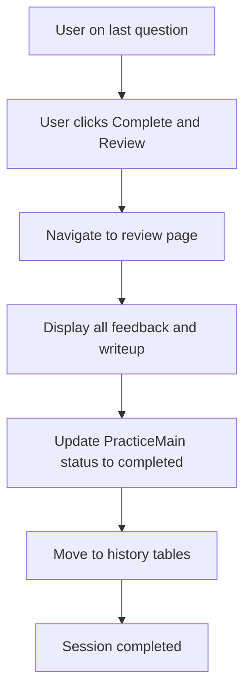

# Review & History Management PRD

**Version:** 1.0  
**Date:** February 14, 2026  
**Status:** Draft  

See [Foundation PRD](00-foundation.md) for history table schemas.

---

## 1. Feature Overview

Review & History Management enables users to review their completed practice sessions and ensures completed sessions are properly archived. After a user finishes all questions and clicks "Complete and Review," they are taken to a review page that displays all feedback, an overall completion summary, and the sample answer write-up. The system then marks the PracticeMain as completed and moves all related records to history tables—keeping active tables small and fast while preserving historical data for analytics and future reference.

---

## 2. Review Page

### 2.1 Functional Requirements

**Priority:** P0 (Must Have)

**User Story:**  
After completing all questions, I want to review all my feedback and see the sample answer.

**Acceptance Criteria:**
- Shown after clicking "Complete and Review" on last question
- Displays:
  - All questions with their feedback
  - Overall completion summary
  - Sample answer/write-up for the QuestionMain
- Actions:
  - View individual question details
  - Download/export session (optional)
  - Start new practice on different QuestionMain
- Marks PracticeMain as completed and moves to history

**API Flow:**
```
1. GET /api/v1/practice-main/{id}/review
   Returns: All practices with feedback, QuestionMain write-up
2. PATCH /api/v1/practice-main/{id} { "status": "completed" }
3. Backend moves records to history tables
```

---

## 3. History Management

### 3.1 Process

When PracticeMain.status changes to 'completed':

1. Copy PracticeMain → PracticeMainHistory
2. Copy all related Practice → PracticeHistory
3. Copy all related PracticeFeedback → PracticeFeedbackHistory
4. Delete from active tables (or soft delete)
5. Happens synchronously on completion

### 3.2 Benefits

- Keep active tables small and fast
- Preserve historical data
- Enable analytics on completed sessions

---

## 4. Data Archival Strategy

### 4.1 History Table Approach

The application uses dedicated history tables to archive completed practice sessions. Active tables (`practice_main`, `practice`, `practice_feedback`) hold only in-progress sessions. When a user completes a session, all related records are copied to the corresponding history tables and removed from active tables.

**Archival Flow:**
1. User completes last question and navigates to review page
2. Frontend calls `PATCH /api/v1/practice-main/{id}` with `status: "completed"`
3. Backend executes archival in a single transaction:
   - INSERT into `practice_main_history` from `practice_main`
   - INSERT into `practice_history` for each related `practice`
   - INSERT into `practice_feedback_history` for each related `practice_feedback`
   - DELETE from active tables (or soft delete via status flag)

### 4.2 History Tables Schema Reference

See [Foundation PRD](00-foundation.md) for full history table schemas. Summary:

```sql
-- Same schemas as active tables
CREATE TABLE practice_main_history AS SELECT * FROM practice_main WHERE 1=0;
CREATE TABLE practice_history AS SELECT * FROM practice WHERE 1=0;
CREATE TABLE practice_feedback_history AS SELECT * FROM practice_feedback WHERE 1=0;
```

The history tables mirror the structure of their active counterparts. Key fields preserved:
- **PracticeMainHistory:** practice_main_id, user_id, question_main_id, status, started_at, completed_at
- **PracticeHistory:** practice_id, practice_main_id, question_id, whiteboard_content, audio_url, submitted_at, updated_at
- **PracticeFeedbackHistory:** practice_feedback_id, practice_id, feedback_text, score, generated_at

### 4.3 Retention Policies

| Data Type | Retention | Notes |
|-----------|-----------|-------|
| Active sessions (practicing) | Indefinite | Until user completes or abandons |
| History tables | 2 years | Completed sessions archived |
| Audio files (active) | Indefinite | Linked to practicing sessions |
| Audio files (history) | 2 years | Aligned with history retention |
| Audit logs | 90 days | Per security requirements |

*Future consideration: Tier-based retention (e.g., free vs paid users) may be introduced.*

---

## 5. Complete Practice Session Flow



---

## 6. API Endpoint: Get Review Page Data

### 6.1 Get Review Page Data

```
GET /api/v1/practice-main/{id}/review

Response (200 OK):
{
  "practice_main": {
    "practice_main_id": 123,
    "question_main_id": 1,
    "status": "completed",
    "started_at": "2026-02-13T09:00:00Z",
    "completed_at": "2026-02-13T11:30:00Z"
  },
  "question_main": {
    "name": "Design Twitter",
    "write_up": "# Sample Solution..."
  },
  "practices": [
    {
      "practice_id": 789,
      "question": {
        "question_id": 1,
        "name": "Define Functional Requirements",
        "type": "Functional Req"
      },
      "feedback": {
        "feedback_text": "...",
        "score": 85.5
      }
    }
  ]
}
```

**Error Responses:**
- 401 Unauthorized
- 403 Forbidden (user does not own this practice session)
- 404 Not Found
- 500 Internal Server Error

---

## 7. UI Components for Review Page

### 7.1 Design System Reference

**Colors:**
- Primary: Blue (#3B82F6)
- Success: Green (#10B981)
- Background: White (#FFFFFF)
- Surface: Light Gray (#F9FAFB)
- Border: Gray (#E5E7EB)
- Text Primary: Dark Gray (#111827)
- Text Secondary: Medium Gray (#6B7280)

**Typography:**
- Heading 1: 32px, Semi-bold
- Heading 2: 24px, Semi-bold
- Body: 16px, Regular
- Small: 14px, Regular

**Spacing:**
- Base unit: 8px
- Padding: 16px, 24px, 32px
- Margins: 8px, 16px, 24px

### 7.2 Review Page Components

**Question Type Badges:**
- Pill shape, 8px padding
- Color coded by question type:
  - Functional Req: Blue
  - Non-Functional Req: Purple
  - Entities: Green
  - API: Orange
  - High Level Design: Red
  - Deep Dive: Dark Red

**Buttons:**
- Primary: Blue background, white text, 40px height (e.g., "Start New Practice")
- Secondary: White background, blue border and text (e.g., "View Question Details")
- Hover: Darken 10%
- Active: Darken 20%

**Feedback Cards:**
- One card per question
- Display: Question name, type badge, feedback text, score (if present)
- Expandable/collapsible for "View individual question details"
- Score displayed prominently when available (e.g., "85.5/100")

**Completion Summary:**
- Overall stats: Questions completed, average score (if applicable)
- Session metadata: Started at, completed at, QuestionMain name

**Sample Answer / Write-up:**
- Markdown-rendered content
- Scrollable container
- Clear section heading separating from feedback

**Loading States:**
- Spinner: Blue rotating circle during data fetch
- Skeleton screens for content loading

**Animations and Transitions:**
- Page transitions: 200ms fade
- Card expand/collapse: 200ms ease
- Button hover: 150ms ease

---

## 8. Testing Scenarios

**Session Completion and History:**
3. User completes all questions → Status changes to 'completed', moves to history

**Review Page:**
13. User on last question clicks "Complete" → Shows review page

**Additional Scenarios:**
- User navigates to review page → All practices with feedback displayed
- User views sample write-up → Markdown renders correctly
- User clicks "Start New Practice" → Navigates to QuestionMain list or next session
- Backend archival fails → User sees error, session remains in practicing state (retry available)
