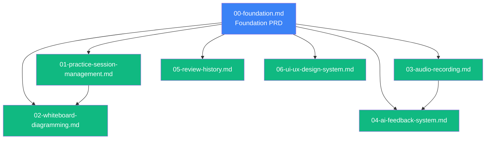

# System Design Practice Application - PRD Documentation

This directory contains the modular Product Requirements Documents (PRDs) for the System Design Practice Application. The original monolithic PRD has been split into focused, actionable documents with high cohesion and low coupling.

## Document Structure

### Foundation PRD
**[00-foundation.md](00-foundation.md)** - Core specifications and shared concerns
- Executive summary and business objectives
- User personas
- Complete glossary and data models
- API base configuration
- Non-functional requirements (performance, security, scalability)
- Technical stack and infrastructure
- Deployment and success criteria

**Referenced by:** All feature PRDs

---

### Feature PRDs

#### **[01-practice-session-management.md](01-practice-session-management.md)**
**Focus:** Session lifecycle, progress tracking, and navigation

**Key Features:**
- Start/resume practice sessions
- Progress tracking with visual indicators
- Question navigation (next/previous)
- Session completion workflow
- State transitions (practicing → completed)

**APIs:** Practice session CRUD operations  
**Dependencies:** Foundation PRD

---

#### **[02-whiteboard-diagramming.md](02-whiteboard-diagramming.md)**
**Focus:** Multi-section whiteboard interface and diagramming capabilities

**Key Features:**
- Two-panel screen layout (20:80 split)
- 5-section whiteboard structure
- Diagramming tools (shapes, arrows, text, connectors)
- Excalidraw integration
- Section focus management
- Zoom, pan, and auto-save

**APIs:** N/A (client-side rendering)  
**Dependencies:** Foundation PRD, Practice Session Management

---

#### **[03-audio-recording.md](03-audio-recording.md)**
**Focus:** Audio recording and upload for design explanations

**Key Features:**
- Browser-based audio recording (MediaRecorder API)
- Recording states (idle, recording, recorded)
- S3 upload integration
- Format validation (WebM, MP4)
- Size limits (50MB max, 10-minute max duration)
- Conditional visibility (High Level Design, Deep Dive only)

**APIs:** Audio upload endpoint  
**Dependencies:** Foundation PRD (S3 configuration)

---

#### **[04-ai-feedback-system.md](04-ai-feedback-system.md)**
**Focus:** AI-powered feedback generation on practice submissions

**Key Features:**
- Practice submission validation
- Diagram-to-text transformation
- LLM integration (OpenAI GPT-4 / Anthropic Claude 3)
- Audio transcription (Whisper API)
- Feedback scoring and display
- Edit and resubmit workflow
- Rate limiting and cost management

**APIs:** Practice submission and feedback generation  
**Dependencies:** Foundation PRD, Audio Recording

---

#### **[05-review-history.md](05-review-history.md)**
**Focus:** Review completed sessions and manage historical data

**Key Features:**
- Review page with all feedback
- Sample answer/write-up display
- History table management
- Data archival strategy
- Retention policies
- Export capabilities

**APIs:** Review page data retrieval  
**Dependencies:** Foundation PRD

---

#### **[06-ui-ux-design-system.md](06-ui-ux-design-system.md)**
**Focus:** Unified design system, component library, and UX specifications

**Key Features:**
- Design tokens (colors, typography, spacing)
- Component specifications (buttons, badges, progress dots)
- Responsive behavior (desktop, tablet, mobile)
- Accessibility requirements (WCAG 2.1 AA)
- Animations and transitions
- Error handling patterns
- Testing requirements (30 scenarios)

**APIs:** N/A (design specifications)  
**Dependencies:** Foundation PRD (technical stack)

---

## How to Use These PRDs

### For Development Teams
1. **Start with Foundation PRD** - Understand the data models, technical stack, and cross-cutting concerns
2. **Choose feature PRDs** - Pick the feature(s) you're implementing
3. **Follow cross-references** - Check "Integration Points" sections for dependencies
4. **Iterate independently** - Each feature PRD can be developed in parallel by separate teams

### For Project Planning
- **Sprint allocation:** Each feature PRD can be a 1-2 week sprint
- **Team assignment:** Assign feature PRDs to specialized teams (frontend, AI, infra)
- **Dependency tracking:** Use "Integration Points" to identify blockers

### For Stakeholders
- **Foundation PRD:** Business case, success metrics, and technical approach
- **Feature PRDs:** Specific functionality and user workflows

---

## Benefits of This Structure

✅ **High Cohesion** - Each PRD focuses on a single functional area  
✅ **Low Coupling** - Minimal dependencies between feature PRDs  
✅ **Actionable** - Each PRD can be assigned to a team/sprint  
✅ **Maintainable** - Changes to one feature don't require updating multiple documents  
✅ **Scalable** - Easy to add new feature PRDs without modifying existing ones  

---

## Document Relationships

---

## Original PRD

The original comprehensive PRD is archived at:  
`../system-design-prd-archive.md`

**Version:** 2.0  
**Date:** February 13, 2026  
**Lines:** 1,749  

---

## Questions or Updates?

For questions about specific features, refer to the individual feature PRDs. For cross-cutting concerns or architectural decisions, consult the Foundation PRD.

**Last Updated:** February 14, 2026
